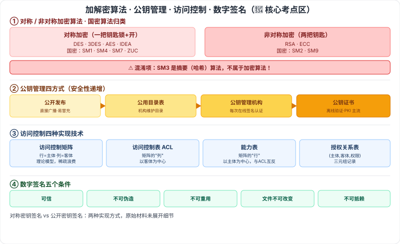

# 4.4 信息加解密技术 · 4.5 密钥管理技术 · 4.6 访问控制及数字签名技术

> 来源：网络取材（主线索 lcp0578/book-note 仓库 + 检索资料交叉印证，见 CLAUDE.md「网络取材来源」）· 对应《系统架构设计师教程（第二版）》第 4 章 · 第 4–6 节

## 一句话概括

本节是信息安全模块的核心考点区，检索确认综合知识科目信息安全模块每年约 4–6 题，**对称/非对称加密辨析、国密算法归类、公钥证书体系、数字签名、访问控制四种实现技术**均为必考核心考点。

---

## 4.4 信息加解密技术

### 4.4.1 数据加密

⚠️ 原始材料本节空白，核心概念已含于 4.4.2/4.4.3，暂不单独展开。

### 4.4.2 对称密钥加密算法 🔴

加密密钥和解密密钥**相同**。原始材料举例：DES、IDEA、AES、SM4。

⚠️ 检索补充：常考还遗漏了 **3DES、国密 SM1、SM7、祖冲之算法（ZUC）**，均属对称算法。

### 4.4.3 非对称密钥加密算法 🔴

加密密钥和解密密钥**不同**。原始材料举例：RSA、SM2。

⚠️ 检索补充：常考还遗漏了 **ECC、SM9**，均属非对称算法。

### 国密算法归类速查表 🔴（检索补充整理，真题高频混淆点）

| 算法 | 类型 |
| --- | --- |
| SM1、SM4、SM7、ZUC | 对称加密 |
| SM2、SM9 | 非对称加密 |
| **SM3** | **摘要（哈希）算法，不属于加密算法**——真题常见混淆项 |

---

## 4.5 密钥管理技术

### 4.5.1 对称密钥的分配与管理

🟡 密钥的使用控制、密钥的分配（原始材料仅标题层级，未展开细节）。

### 4.5.2 公钥加密体制的密钥管理 🔴

四种公钥管理方式（原始材料仅有名称，以下为检索补充展开，供参考）：

| 方式 | 说明 | 安全性 |
| --- | --- | --- |
| 🔴 公开发布 | 用户直接广播/公开自己的公钥（邮件、公告栏） | 最低，易被冒充篡改 |
| 🔴 公用目录表 | 可信机构维护"用户名—公钥"动态目录供查询 | 较高，但目录本身可能被攻击篡改 |
| 🔴 公钥管理机构 | 在目录表基础上强化控制，每次查询需机构在线签名认证 | 更高，但机构易成瓶颈、需实时交互 |
| 🔴 公钥证书 | CA 用自己私钥对用户公钥+身份信息签名形成证书，双方交换证书后可**离线验证**，无需实时查询机构 | 最高，是当前 **PKI 体系**主流方案 |

### 4.5.3 公钥加密分配单钥密码体制的密钥

⚠️ 原始材料本节空白，暂不展开，待翻实体书核对。

---

## 4.6 访问控制及数字签名技术

### 4.6.1 访问控制技术

🟡 **基本模型**：主体依据某些控制策略或权限对客体本身或其资源进行不同授权访问。

### 访问控制四种实现技术 🔴

| 技术 | 说明 |
| --- | --- |
| 🔴 访问控制矩阵 | 理论模型：行=主体、列=客体，交叉格存权限；系统大时矩阵稀疏、浪费存储 |
| 🔴 访问控制表（ACL） | 以**客体**为中心，取矩阵的"列"，记录谁能访问该资源及权限，便于查某资源的授权用户 |
| 🔴 能力表 | 以**主体**为中心，取矩阵的"行"，记录该用户可访问的资源及权限，便于查某用户的全部权限，与 ACL **互为反向** |
| 🔴 授权关系表 | 以（主体, 客体, 权限）三元组逐条记录，即矩阵的稀疏化/关系数据库实现方式 |

### 4.6.2 数字签名 🔴

数字签名的五个条件（真题常以反向排除法命题）：

1. 🔴 签名是可信的
2. 🔴 签名不可伪造
3. 🔴 签名不可重用
4. 🔴 签名的文件是不可改变的
5. 🔴 签名是不可抵赖的

🟡 两种实现方式：**对称密钥签名**、**公开密钥签名**（原始材料未展开细节）。

---

## 记忆钩子

- 对称 vs 非对称的本质区别就一句话：**钥匙是不是一把**——对称用一把钥匙锁和开，非对称用两把（公钥锁、私钥开，或反过来）。
- 国密算法归类口诀：**S(M)2/9 非对称，S(M)1/4/7 对称，S(M)3 单独摘要**——SM3 数字最特殊（奇数且是摘要），其余按"能不能被2整除"式的规律记不住就死记这张表。
- 公钥管理四方式是"安全性递增"的一条线：**公开发布**（裸奔）→ **公用目录表**（有人管目录）→ **公钥管理机构**（每次都要问）→ **公钥证书**（发个证以后不用再问，PKI 主流）。
- 访问控制矩阵拆开看：**按列拆=访问控制表（对着资源问谁能进）**，**按行拆=能力表（对着人问能进哪些资源）**——两者互为镜像。

## 关键词

`对称加密` `非对称加密` `DES` `AES` `RSA` `国密算法` `SM2` `SM3` `SM4` `摘要算法` `公钥证书` `PKI` `CA` `访问控制矩阵` `访问控制表` `ACL` `能力表` `授权关系表` `数字签名`
