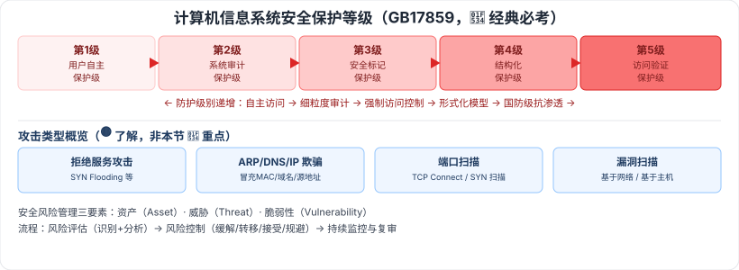

# 4.7 信息安全的抗攻击技术 · 4.8 信息安全的保障体系与评估方法

> 来源：网络取材（主线索 lcp0578/book-note 仓库 + 检索资料交叉印证，见 CLAUDE.md「网络取材来源」）· 对应《系统架构设计师教程（第二版）》第 4 章 · 第 7–8 节（本章最后两节）

## 一句话概括

本节讲各类攻击手段与防御（拒绝服务、欺骗、扫描）+ 安全体系的等级划分与风险管理；**计算机信息系统安全保护等级五级（GB17859-1999）**是检索确认的经典高频必考点。

---

## 4.7 信息安全的抗攻击技术

### 4.7.1 密钥的选择

🟡 密钥分两类：**数据加密密钥（DK）**（直接对数据进行操作）、**密钥加密密钥（KK）**（用于保护密钥）。

🟡 密钥生成需考虑三个因素：**增大密钥空间、选择强钥、密钥的随机性**。

### 4.7.2 拒绝服务攻击与防御

🟡 拒绝服务攻击的防御方法：加强对数据包的特征识别、设置防火墙监视本地主机端口使用情况、对通信数据量进行统计（获取攻击系统位置和数量信息）、尽可能修正已发现的问题和系统漏洞。

⚠️ 检索补充：DoS 可分**带宽攻击**、**协议攻击**（如利用 TCP 三次握手制造大量半连接耗尽资源，即 SYN Flooding）、**逻辑攻击**（如 LAND 攻击），教材是否有此分类待核对。

### 4.7.3 欺骗攻击与防御

🟡 三类：**ARP 欺骗、DNS 欺骗、IP 欺骗**（原始材料未展开原理，以下为检索补充）：

| 欺骗类型 | 原理（检索补充） |
| --- | --- |
| ARP 欺骗 | 利用局域网通信依赖 MAC 地址而非 IP 的机制，伪造/缓存虚假的 IP-MAC 对应关系，使目标机器把数据发往攻击者，实现流量劫持或中间人攻击 |
| DNS 欺骗 | 冒充域名服务器，向目标返回伪造的 IP 地址，使受害者访问的实际是攻击者控制的主机而非真实网站 |
| IP 欺骗 | 伪造数据包的源 IP 地址，隐藏发送者身份或冒充受信任主机，利用主机间信任关系发起攻击（常与 SYN Flood 配合） |

### 4.7.4 端口扫描

⚠️ 原始材料本节空白，以下为检索补充（供参考）：常见类型——**TCP Connect 扫描**（全连接，完成三次握手，准确但易被检测）、**TCP SYN 扫描**（半开放，只发 SYN、收到 SYN-ACK 后回 RST，隐蔽性更好）、FIN 扫描等隐蔽方式。

### 4.7.5 强化 TCP/IP 堆栈以抵御拒绝服务攻击

🟡 三种典型攻击：**同步包风暴（SYN Flooding）、ICMP 攻击、SNMP 攻击**（原始材料未展开具体强化措施）。

### 4.7.6 系统漏洞扫描

🟡 两类：

| 类型 | 特点 |
| --- | --- |
| 基于网络的漏洞扫描 | （原始材料未展开） |
| 基于主机的漏洞扫描 | 扫描的漏洞数量多、集中化管理、网络流量负载小 |

---

## 4.8 信息安全的保障体系与评估方法

### 4.8.1 计算机信息系统安全保护等级 🔴

⚠️ 检索确认：**GB17859-1999**《计算机信息系统安全保护等级划分准则》，该五级划分及顺序在软考高级历年真题中反复出现，是经典必背考点。

| 等级 | 名称 | 核心特征（检索补充） |
| --- | --- | --- |
| 🔴 第 1 级 | 用户自主保护级 | 隔离用户与数据，自主访问控制 |
| 🔴 第 2 级 | 系统审计保护级 | 细粒度访问控制 + 审计 |
| 🔴 第 3 级 | 安全标记保护级 | 增加安全策略模型、数据标记、强制访问控制 |
| 🔴 第 4 级 | 结构化保护级 | 形式化安全策略模型，扩展访问控制，考虑隐蔽通道 |
| 🔴 第 5 级 | 访问验证保护级 | 满足访问监控器需求，抗篡改、最小化复杂性，抗渗透能力最高，适用国防等关键部门 |

### 4.8.2 安全风险管理

⚠️ 原始材料本节空白，以下为检索补充（供参考）：核心三要素——**资产（Asset）、威胁（Threat）、脆弱性（Vulnerability）**；流程通常含：风险评估（识别资产/威胁/脆弱性 → 分析可能性与影响）→ 风险控制（选择缓解/转移/接受/规避策略并实施安全措施）→ 持续监控与复审。

---

## 记忆钩子

- 安全保护等级五级记口诀：**自主 → 审计 → 标记 → 结构化 → 验证**，一级比一级"管得更细、防得更死"，第 5 级"访问验证保护级"是国防级、最高级。
- 三种欺骗攻击按"骗什么"记：**ARP 骗 MAC 地址**、**DNS 骗域名解析**、**IP 骗源地址身份**——都是"冒充"的不同层级。
- DK/KK 两类密钥：**DK 直接干活**（加密数据本身），**KK 保护干活的工具**（加密密钥本身）。

## 关键词

`数据加密密钥` `密钥加密密钥` `拒绝服务攻击` `SYN Flooding` `ARP欺骗` `DNS欺骗` `IP欺骗` `端口扫描` `TCP SYN扫描` `漏洞扫描` `安全保护等级` `GB17859` `用户自主保护级` `访问验证保护级` `安全风险管理`
